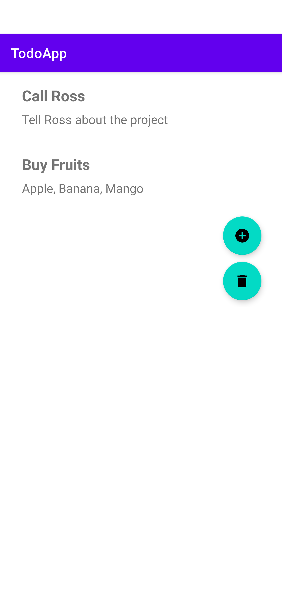
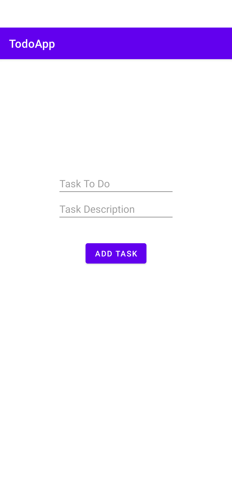
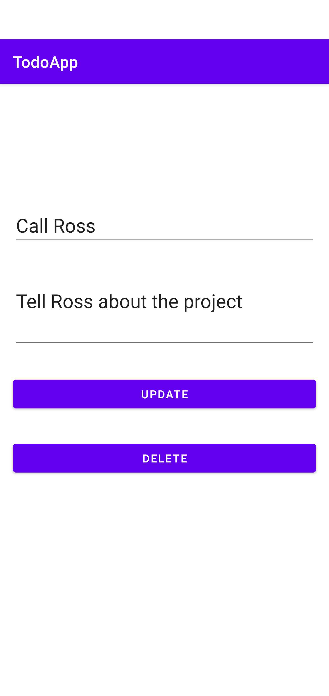
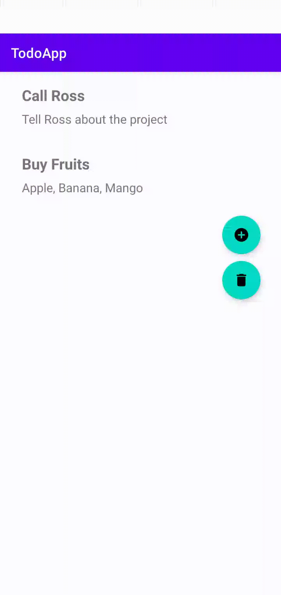
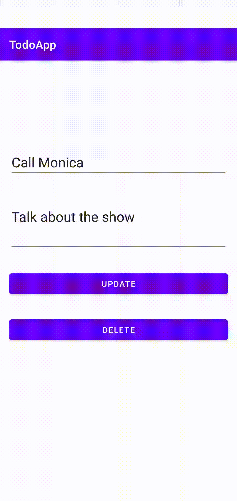
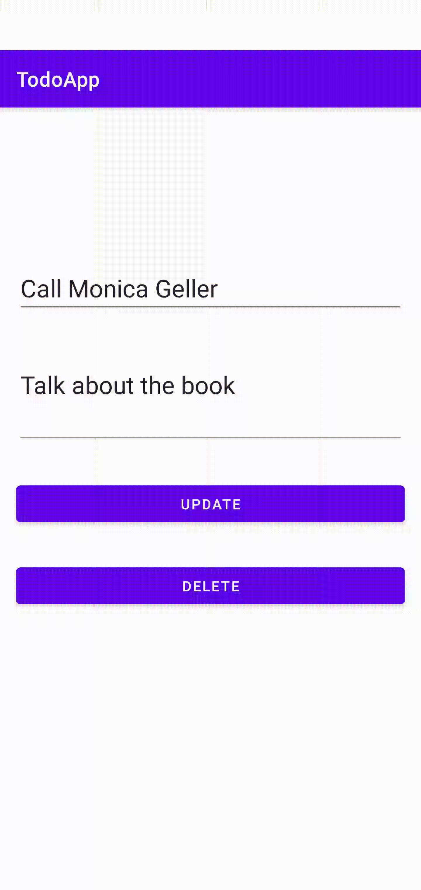

<h1>ToDo Application</h1>

<h3> Features in this application: </h3>
<ul>
	<li>Create a todo entry</li>
	<li>Add description to a todo entry</li>
	<li>Edit the todo entry and description</li>
	<li>Delete a todo entry</li>
	<li>Delete all todo entries</li>
</ul>

Application's home screen

Application's add task screen

Application's edit/delete task screen

Adding a task

Updating a task

Deleting a task

Deleting all task

